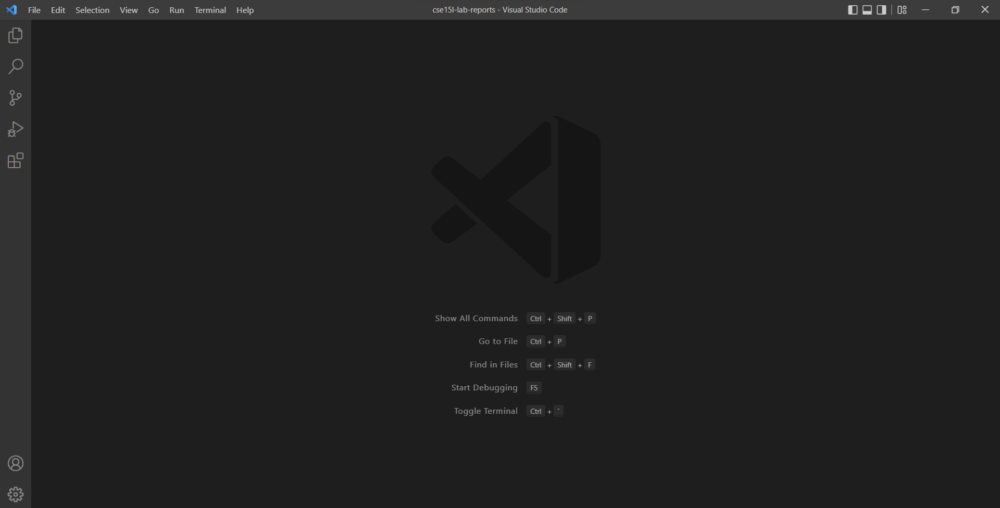
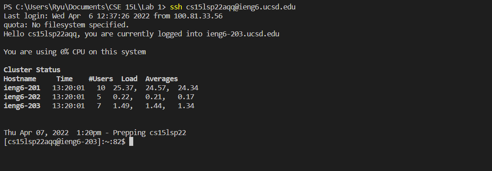
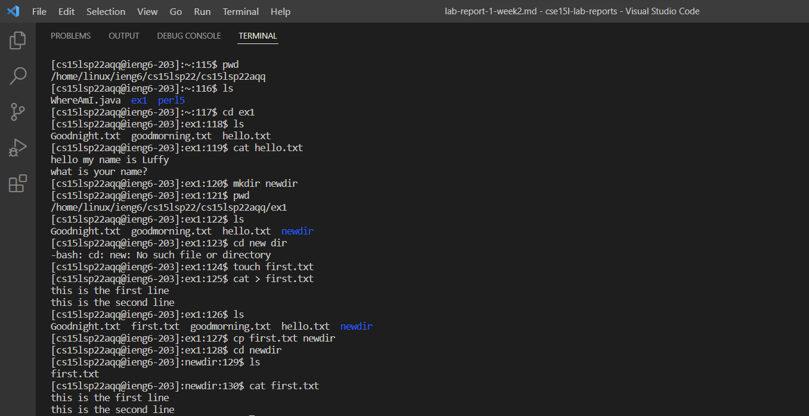
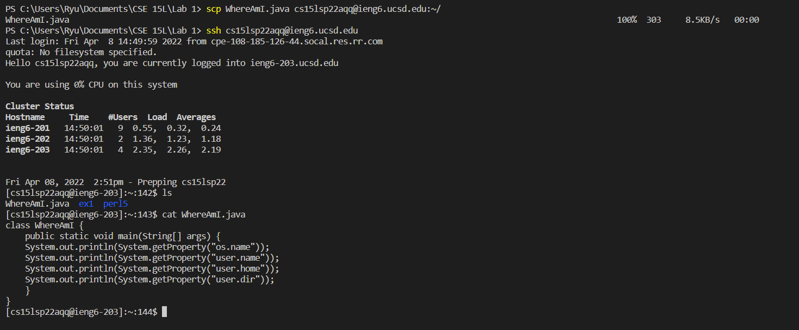
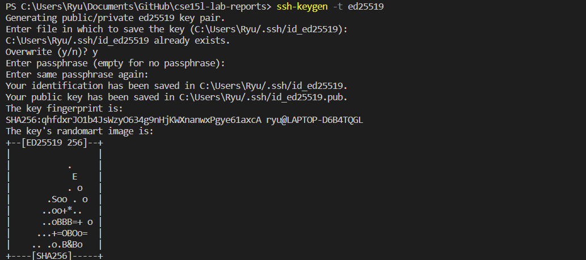
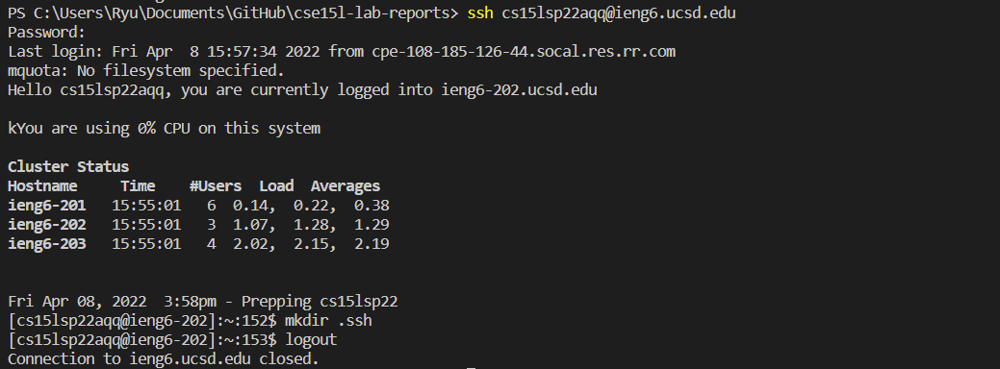
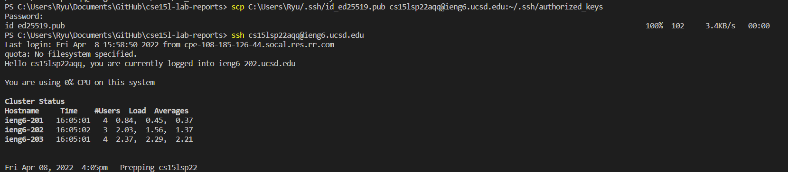
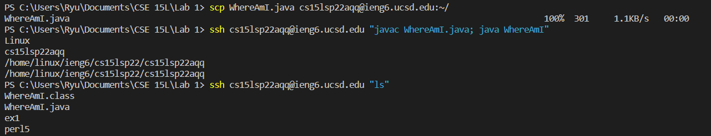

# **Lab Report 1 - Week 2**

## **Installing VScode** 

- Go to the Visual Studio Code website [https://code.visualstudio.com/](https://code.visualstudio.com/) to download and install VScode into your computer

- When it is installed, it should look something similar to the image below

## **Remotely Connecting** 

- First install OpenSSh into your computer (use [Install OpenSSH](https://docs.microsoft.com/en-us/windows-server/administration/openssh/openssh_install_firstuse) for help)

- Open a new terminal in VScode and type the command `ssh cs15lsp22zz@ieng6.ucsd.edu` where `zz` is replaced with your letters in your course-specific acount

- enter password and you should see something similar to the image below

## **Trying Some Commands**

- In the terminal, try running some commands, including:
    - `ls` : list files
    - `pwd` : print working directory 
    - `mkdir` : make directory
    - `cd` : change directory
    - `cp` : copy
    - `rm` : remove
    - `touch` : creat a file
    - `cat` : view or create a file

- Try exploring different commands on both *your* computer and the *remote* computer using `ssh`

## **Moving Files with `scp`**

- Run the command `scp` in the client to copy a file from your computer to the local computer

- In the terminal run the command `scp (file name) cs15lsp22zz@ieng6.ucsd.edu:~/`

- Then try logging in to the remote computer to see if the file successfully copied

## **Setting an SSH Key**

- Open the terminal and create public and private keys
    - For Windows: use the command `ssh-keygen -t ed25519`
    - For non-Windows: use the command `ssh-keygen`

- Keep pressing the **Enter** key until you see something similar to below image

- Then log in to the remote server and type the command `mkdir .ssh`

- Back on the client, use the command `$ scp /Users/<user-name>/.ssh/id_rsa.pub cs15lsp22zz@ieng6.ucsd.edu:~/.ssh/authorized_keys`

- log in to the remote server to check if it doesn't ask for password

## **Optimizing Remote Running**

- To optimize remote running, try running commands in quotes at the end of `ssh`

- In the example below, I ran the WhereAmI.java on the remote computer and check to see if both WhereAmI.java and WhereAmI.class was created

