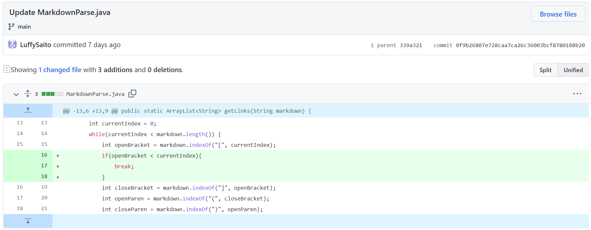
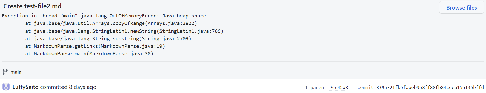
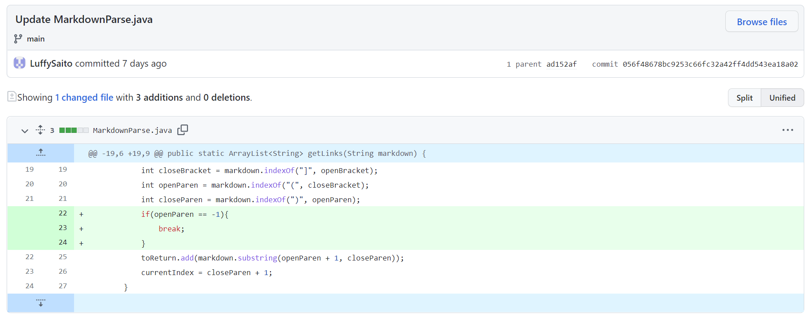
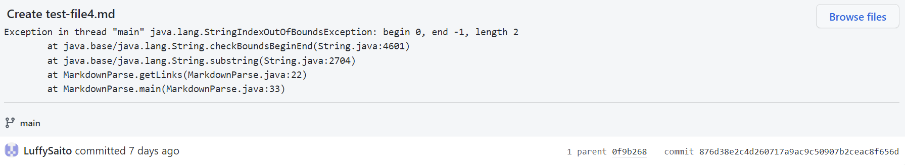
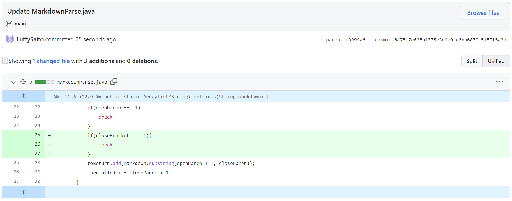
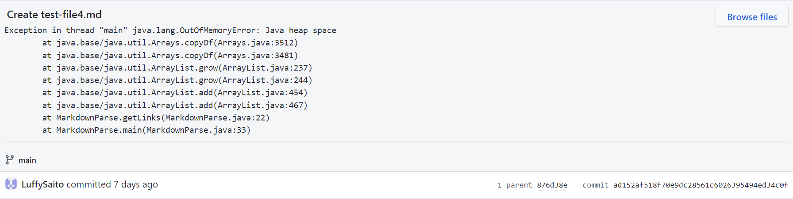

# **Lab Report 2 - Week 4**

## **Code Change #1**

**Code change:**

**Link to the test file:**
[mytest-file1.md](https://github.com/LuffySaito/markdown-parser/blob/main/mytest-file1.md)

**Error:**

The failure inducing input was the file which had an extra line at the end with not text. This prevented the program from terminating, which was the bug, and caused the OutOfMemoryError, which was the symptom.

## **Code Change #2**

**Code change:**

**Link to the test file:**
[mytest-file2.md](https://github.com/LuffySaito/markdown-parser/blob/main/mytest-file2.md)

**Error:**

The failure inducing input was the file which contained only brackets and no parentheses. This caused the program to continue running even when the variable openParen was -1, which was the bug. The symptom was the OutOfBoundsException caused by this openParen with value -1. 

## **Code Change #3**

**Code change:**

**Link to the test file:**
[mytest-file3.md](https://github.com/LuffySaito/markdown-parser/blob/main/mytest-file3.md)

**Error:**

The failure inducing input was the file which contained brackets and only the open parenthesis. This caused the program to continue searching for the close parenthesis without termination, the bug of the program. As a result, the program threw a OutOfMemoryError, which was the symptom.