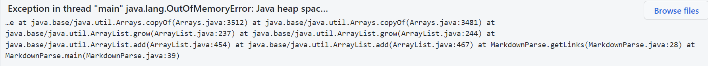

# **Lab Report 2 - Week 4**

## **Code Change #1**

Code change:

Link to the test file:
[mytest-file1.md](https://github.com/LuffySaito/markdown-parser/blob/main/mytest-file1.md)

Error:

explanation

## **Code Change #2**

Code change:

Link to the test file:
[mytest-file2.md](https://github.com/LuffySaito/markdown-parser/blob/main/mytest-file2.md)

Error:

explanation

## **Code Change #3**

Code change:

Link to the test file:
[mytest-file3.md](https://github.com/LuffySaito/markdown-parser/blob/main/mytest-file3.md)

Error:

explanation