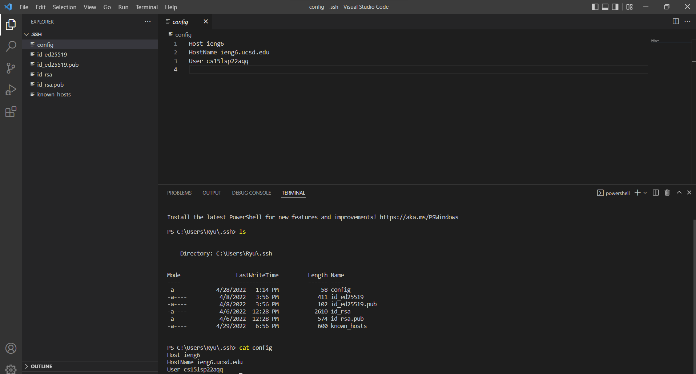
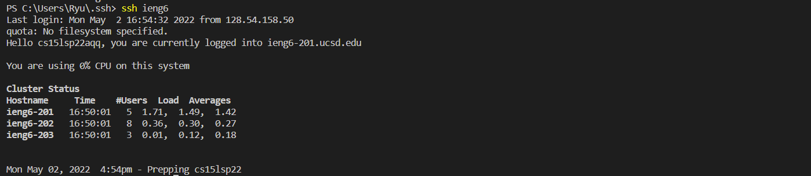
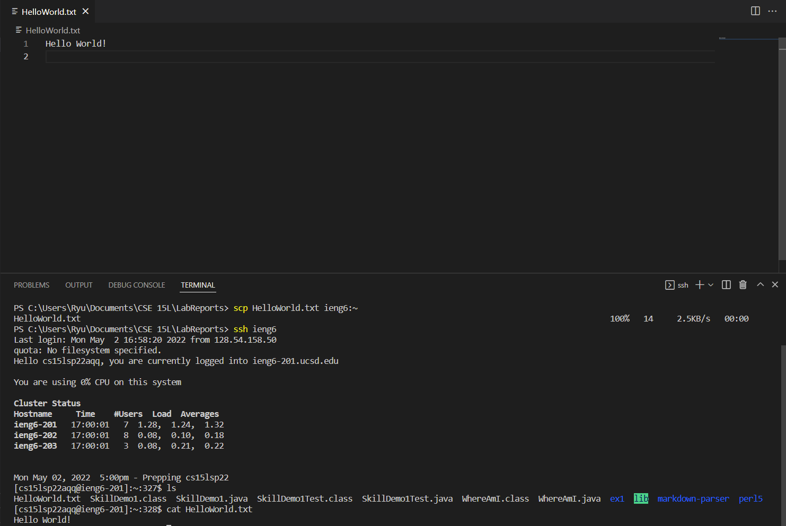

# **Lab Report 3 - Week 6**

## **Streamlining ssh Configuration**

Using VScode, I created a config file under `.ssh` directory.

Now, I am able to access the server using the alias `ieng6`

Similarly, I can `scp` using the same alias, and I checked whether if the file copied successfully.

## **Setup Github Access from ieng6**

## **Copy whole directories with `scp -r`**

