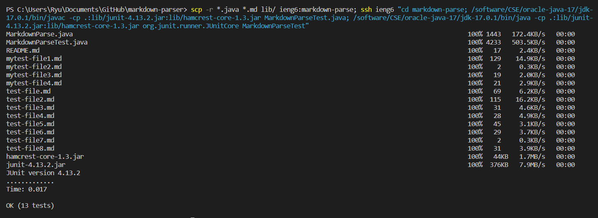

# **Lab Report 3 - Week 6**

## **Streamlining ssh Configuration**

Using VScode, I created a config file under `.ssh` directory.

Now, I am able to access the server using the alias `ieng6`

Similarly, I can `scp` using the same alias, and I checked whether if the file copied successfully.

## **Setup Github Access from ieng6**

Public key stored on Github:

Public key stored on user account:

Private key stored on user account:

Using the command `git push origin main` a new file HelloWorld.txt was successfully pushed to the main repository

Resulting Commit: [https://github.com/LuffySaito/cse15l-lab-reports/commit/2a93e46f380ff13cfa8d8d697ca47f1b53989f7f](https://github.com/LuffySaito/cse15l-lab-reports/commit/2a93e46f380ff13cfa8d8d697ca47f1b53989f7f)

## **Copy whole directories with `scp -r`**

Successfully copied the directory markdown-parse onto the server using `scp -r`

Test successfully runs on the server.

Combining `scp`, `ssh`, and the run commmands, I am able to copy the directory, log in to the server, and run the test on the server in one line.

