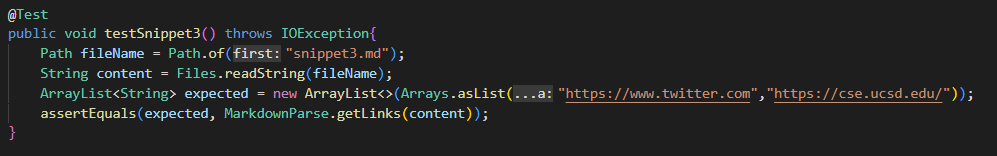
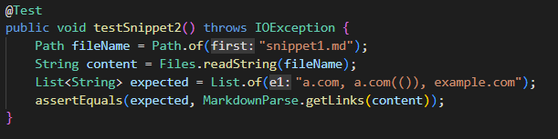
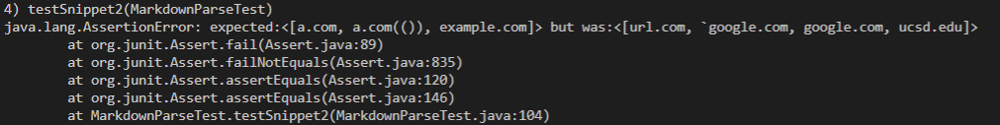

# **Lab Report 4 - Week 8**

## **My Implementation**

Link: [https://github.com/LuffySaito/markdown-parser](https://github.com/LuffySaito/markdown-parser)

### **Snippet 1** ##

Expected Output: [`google.com]

Test failed:

### **Snippet 2** ##

Expected Output: [a.com, a.com(()), example.com]

Test failed:

### **Snippet 3** ##

Expected Output: [https://www.twitter.com, https://cse.ucsd.edu/]

Test failed:

## **Implementation Reviewed in Week 7**

Link: [https://github.com/AllKeng/markdown-parser](https://github.com/AllKeng/markdown-parser)

### **Snippet 1** ##

Expected Output: [`google.com]

Test failed:

### **Snippet 2** ##

Expected Output: [a.com, a.com(()), example.com]

Test failed:

### **Snippet 3** ##

Expected Output: [https://www.twitter.com, https://cse.ucsd.edu/]

Test failed:

## **Questions**

For cases with backticks like Snippet 1, I can add an if statement checking whether if back ticks exist, and if it does I can ignore all brackets and parenthesis between backticks. In this way, the getLinks will recognize the strings inside the backticks as inline code.

For cases with nest parentheses, brackets, and escaped brackets like Snippet 2, there isn't small code change that can resolve the failure since I still have to keep track of the indexes of these nested brackets using indexOf. 

For cases with newlines, I can add small code changes that detects spaces between the brackets using if statement. If there is empty space, then I can simply ignore those spaces and catch all the strings that are actually words. 