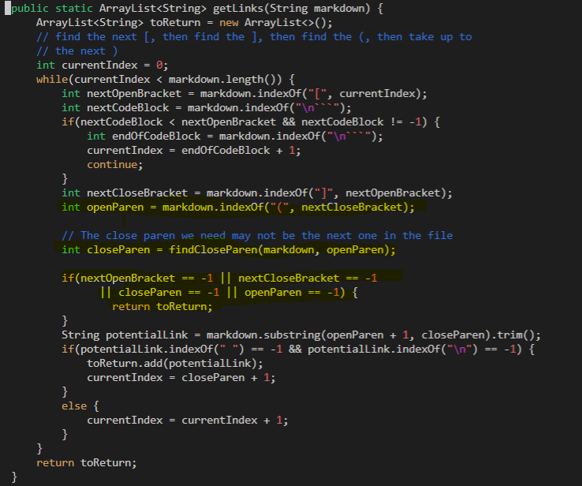
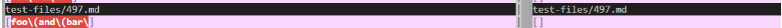

# **Lab Report 5 - Week 10**

I used the command `vimdiff my-markdown-parser/results.txt cse15lsp22-markdown-parser/results.txt` to search for two tests that had different results.

Link to the two test files:

[test-file-496](https://github.com/nidhidhamnani/markdown-parser/blob/main/test-files/496.md)

[test-file-497](https://github.com/nidhidhamnani/markdown-parser/blob/main/test-files/497.md)

### **Test-file-496** ##

Expected Output: [foo(and(bar)]

Neither implementation are correct because my program recognized “foo(and(bar” as a link whereas the given program returned an empty string. 

Since the provided implementation returns an empty string as an output, it probably is passing the if statement highlighted in yellow and returns toReturn before it is assigned to anything. Then, the bug exists in the previous statements where openParen and closeParen is assigned since one or both have the value -1. To fix, we shouold provide some test cases to see what are being passed into these two variables and determine the necessary change.

### **Test-file-497** ##

Expected Output: [foo\\(and\\(bar\\)]

Neither implemention are correct since my program recognized “foo\\(and\\(bar\” as a link whereas the given program returned empty string.

For my implementation, it is ignoring the double close parenthesis at the end. The bug exists in the highlighted lines in yellow where the index of closeParen are assigned. My program doesn't account the case in which the close parenthesis is part of the link and just considers it as the end of a link. To fix, I have to change the code so it considers the possibility that the close parenthesis is in the link, not signifying the end of a link.